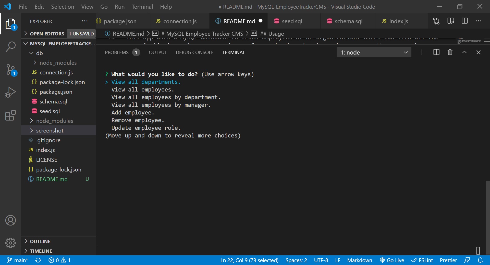
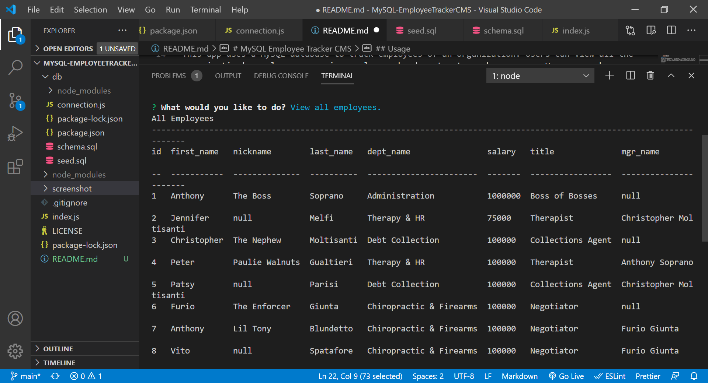

# MySQL Employee Tracker CMS

## Table of Contents:
  1. [Description](#description) 
  2. [Installation](#Installation)
  3. [Usage](#Usage)  
  4. [Contributing](#Contributing)
  5. [Tests](#Tests)
  6. [License](#License)
  7. [GitHub](#GitHub)
  8. [E-mail](#E-mail)

## Description
This app uses a MySQL database to track employees of an organization. Users can view all the organization's employees, or view employees by department, or by manager. Users can change an employee's role, update the employee's manger, add employees, or delete employees. Behind the scenes several MySql tables are being updated and joined in a variety of ways using id's and foreign keys.  

Sceenshots

## Installation
Users must fork the database and install the program's required node/npm  dependencies.

## Usage

Run the application with node index in the console.  Then select the desired action.  When finished, feel free to select End Session to disconnect from the database.

## Contributing
Feel free to contribute.

## Tests
Update any existing tests as appropriate.

## License

## GitHub
EsmondKim

## E-mail
Contact me via LinkedIn.